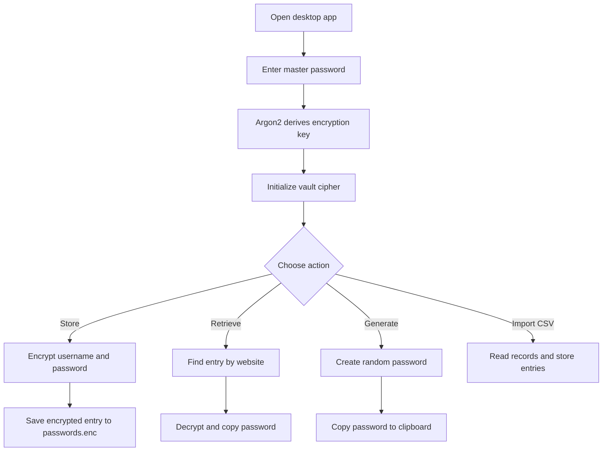
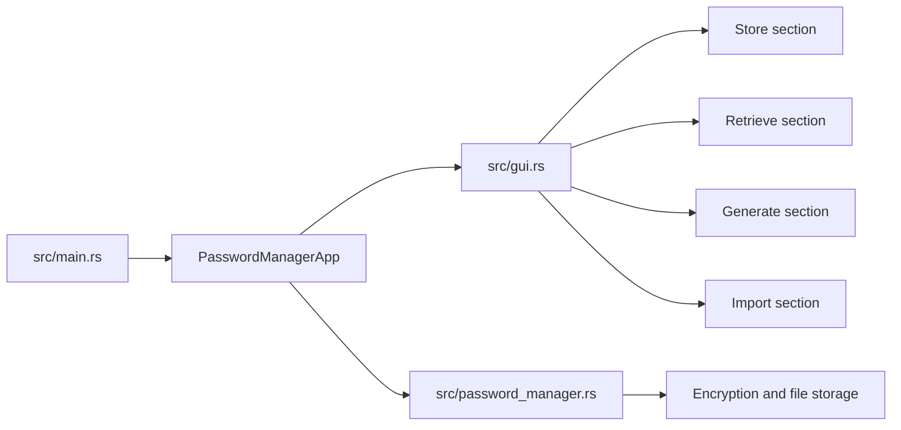

<div align="center">

# Secure Password Manager

[](https://www.rust-lang.org/)
[](https://github.com/emilk/egui)
[](https://docs.rs/chacha20poly1305/)

A Rust desktop password manager with a dark egui interface, Argon2 key derivation, encrypted storage, password generation, clipboard copy, and CSV import.

[GitHub repo](https://github.com/Konseptt/Password_manager_rust)

</div>

## Why I built this

I built this to practice real Rust application structure around something practical: encrypted local password storage. The app has a GUI, a password vault file, generated passwords, clipboard support, and a small import flow.

It is a learning project, but I tried to keep the security building blocks serious.

## What it does

- Unlocks with a master password
- Derives an encryption key with Argon2
- Stores website, username, and password entries in an encrypted JSON file
- Uses XChaCha20-Poly1305 for authenticated encryption
- Generates random passwords with symbols, numbers, and letters
- Copies generated or retrieved passwords to the clipboard
- Imports saved credentials from a CSV file
- Includes unit tests for storing, retrieving, generating, and importing

## App flow



## Code structure



## Tech stack

| Area | Crates |
|---|---|
| Desktop UI | `eframe`, `egui` |
| Encryption | `chacha20poly1305` |
| Key derivation | `argon2` |
| Data format | `serde`, `serde_json` |
| Randomness | `rand` |
| Clipboard | `copypasta` |
| CSV import | `csv` |
| Errors | `anyhow` |

## Run locally

```bash
cargo run
```

Run tests:

```bash
cargo test
```

## CSV import format

The current import code expects the URL, username, and password at indexes 1, 2, and 3 in each CSV row. That matches many exported password manager CSV formats where column 0 is a name or title.

## Security note

This is still a personal learning project. I would review file permissions, memory handling, CSV validation, and platform-specific clipboard behavior before treating it like a production vault.
